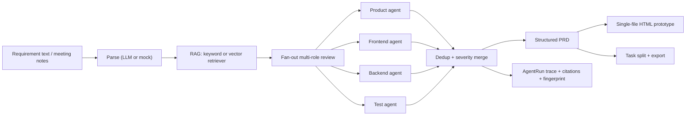

# ReqPilot

> A domain-aware requirements engineering agent: natural language in, structured
> PRD + multi-role review + interactive prototype + development tasks out.

ReqPilot turns meeting notes, chat records, and plain-language requirements into
a structured PRD, a quality-review report produced by product / frontend /
backend / test agents, a single-file HTML interactive prototype, and exportable
development tasks. It is built around four ideas:

1. **Structured outputs everywhere** — every LLM step returns schema-validated
   JSON (Pydantic), with one repair attempt and a deterministic safe fallback.
2. **Observable multi-agent workflow** — the pipeline is a LangGraph state
   machine with parallel per-role review, deduplication, severity grading, and
   citation-tracked evidence.
3. **Domain grounding via RAG** — a pluggable retriever injects domain terms and
   rules with source citations, reducing hallucinated review issues.
4. **Local-first, honest evaluation** — the whole pipeline runs without any API
   key using a rule-based mock provider; an optional OpenAI-compatible provider
   (DeepSeek etc.) is available, and `reqpilot eval` reports measured numbers.

## Architecture



## Quick start

Requirements: Python 3.11+ and [uv](https://docs.astral.sh/uv/).

```bash
git clone https://github.com/Sh1njuuovo/reqpilot.git
cd reqpilot
uv sync --extra dev
uv run reqpilot smoke
uv run pytest
```

`reqpilot smoke` runs the built-in sample requirement through the full pipeline
with the mock provider (no API key needed) and writes artifacts under
`reports/smoke/`.

### Optional real-LLM provider

```bash
export DEEPSEEK_API_KEY=sk-...
uv run reqpilot demo --provider llm
```

Any OpenAI-compatible endpoint works via `REQPILOT_LLM_BASE_URL`,
`REQPILOT_LLM_MODEL`, or `OPENAI_API_KEY`. Without a key, every step falls back
to the deterministic mock provider and records the fallback in the run trace.

## CLI

| Command | What it does |
| --- | --- |
| `reqpilot smoke` | Run the sample requirement end-to-end (mock), assert success, write artifacts |
| `reqpilot demo` | Same pipeline, writes a demo bundle (`PRD.md`, `prototype.html`, `tasks.md`) |
| `reqpilot serve` | Start the FastAPI service (see API below) |
| `reqpilot eval` | Run the evaluation suite over `eval/cases/`, write measured metrics to `reports/eval/` |

## HTTP API

```bash
uv run reqpilot serve
```

- `POST /requirements` — body `{"text": "...", "domain": "generic", "provider": "mock"}`; runs the pipeline and returns the run summary.
- `GET /requirements/{run_id}` — run summary + traces.
- `GET /requirements/{run_id}/prd` — structured PRD (JSON).
- `GET /requirements/{run_id}/issues` — deduplicated review issues.
- `GET /requirements/{run_id}/tasks` — development tasks (JSON).
- `GET /requirements/{run_id}/prototype` — the single-file HTML prototype.

## Evaluation

`reqpilot eval` runs the pipeline over a curated 12-case set with golden labels
and measures schema completeness, review-issue recall/precision, and dedup
effectiveness. Results are written to `reports/eval/` as JSON + Markdown.
Latest measured numbers (mock provider, 2026-08-26):

- Pipeline success rate: 100% (12/12)
- Average field completeness: 86.1%
- Issue-label recall: 100%
- Issue-label precision: 100%
- Average dedup rate: 5.6% (cross-role duplicate merging)
- Average end-to-end latency: 6 ms/case (CPU, mock provider)

All numbers are produced by running `reqpilot eval`; regenerate them any time
with `uv run reqpilot eval`.

## Project layout

```text
src/reqpilot/        core package (models, providers, pipeline, RAG, prototype, API, CLI)
eval/cases/          evaluation requirements + golden labels
eval/knowledge/      domain knowledge base used by the retriever
tests/               unit + integration tests
reports/             smoke, eval, and interview-pack artifacts
docs/design.md       design document
```

## License

MIT
