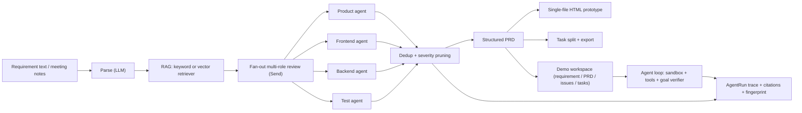
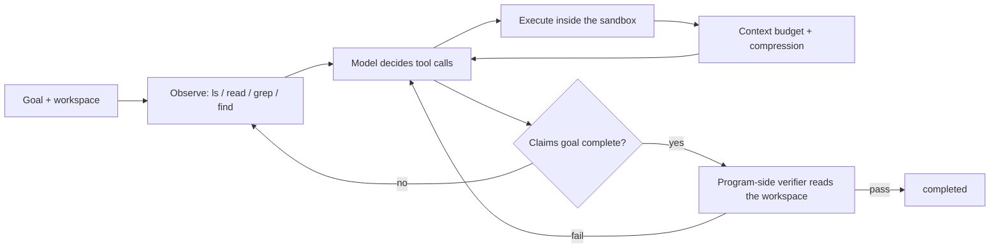

# ReqPilot

> An LLM-driven requirements engineering agent: natural language in, structured
> PRD + multi-role review + interactive prototype + development tasks out.

ReqPilot turns meeting notes, chat records, and plain-language requirements into
a structured PRD, a quality-review report produced by product / frontend /
backend / test agents, a single-file HTML interactive prototype, and exportable
development tasks. It is built around four ideas:

1. **LLM-native pipeline** — the whole chain (parse → review → PRD → tasks) runs
   on an OpenAI-compatible model, orchestrated as a LangGraph state machine.
2. **Structured outputs with guardrails** — every model call returns
   schema-validated JSON (Pydantic) with one repair attempt, transient retries,
   and typed error traces; issues are deduplicated and pruned to the top-N per
   role so the final list is human-reviewable.
3. **Domain grounding via RAG** — a pluggable retriever injects domain terms and
   rules with source citations, reducing hallucinated review findings.
4. **Evaluation against a human standard** — 12 curated cases with
   human-reviewer golden labels, measured end-to-end with a real LLM.
5. **A sandboxed tool-calling loop** — on top of the fixed pipeline, a goal-driven
   loop works inside a jailed workspace with a small tool set, compresses its own
   context, and only reports success when a program-side verifier agrees.

## Architecture



## Sandboxed agent loop

`reqpilot demo` writes a workspace, and `reqpilot agent` hands that workspace to a
goal-driven loop that keeps working until the goal is met or the step budget runs
out.



- **Workspace jail** — every path goes through one sandbox object, so `../` and
  absolute paths outside the workspace raise instead of quietly working.
- **Read-only shell** — `bash` runs an allowlist of read-only commands without a
  shell, which removes pipes, redirects, command chaining and `find -exec` as
  escape routes.
- **Small tool set** — `ls`, `read`, `write`, `append`, `edit`, `grep`, `find`,
  `bash`, plus `remember`; no bespoke function per feature. `append` exists so a
  long file can be built in chunks instead of one oversized tool argument.
- **Context budget** — once the token estimate crosses a threshold, older
  messages collapse into one summary, the full transcript is appended to
  `session.jsonl`, and durable facts go to `MEMORY.md`.
- **Verified completion** — a `goal_complete` claim only triggers the checks in
  `reqpilot.agent.checks`. The run is marked completed only if the workspace
  really satisfies the goal, so a confident model cannot end the run by
  asserting success.

## Quick start

Requirements: Python 3.11+, [uv](https://docs.astral.sh/uv/), and a
DeepSeek / OpenAI-compatible API key.

```bash
git clone https://github.com/Sh1njuuovo/reqpilot.git
cd reqpilot
uv sync --extra dev
export DEEPSEEK_API_KEY=sk-...
uv run reqpilot smoke
uv run pytest
```

`reqpilot smoke` runs the built-in sample requirement through the full LLM
pipeline and writes artifacts under `reports/smoke/`. The provider is
OpenAI-compatible: set `REQPILOT_LLM_BASE_URL` / `REQPILOT_LLM_MODEL` /
`OPENAI_API_KEY` to switch endpoints.

## CLI

| Command | What it does |
| --- | --- |
| `reqpilot smoke` | Run the sample requirement end-to-end with the LLM, assert success, write artifacts |
| `reqpilot demo` | Same pipeline, writes a demo bundle (`PRD.md`, `prototype.html`, `tasks.md`) |
| `reqpilot agent` | Run the sandboxed tool-calling loop over a demo workspace, verifying the goal before reporting success |
| `reqpilot serve` | Start the FastAPI service (see API below) |
| `reqpilot eval` | Run the evaluation suite over `eval/cases/`, write measured metrics to `reports/eval/` |
| `reqpilot tune` | Measure named review-prompt variants on the same 12 cases and pick one by a stated rule |

`smoke` / `demo` / `eval` accept `--retriever keyword|vector`. Without an API
key they exit with a clear error instead of producing fake output.

```bash
uv run reqpilot demo                                    # write reports/demo/
uv run reqpilot agent --workspace reports/demo --max-steps 8
```

`reqpilot agent` defaults to the review-repair goal: every `critical` or `major`
issue in `issues.json` must be answered in `review-fixes.md`, and `tasks.md` must
still be present. Pass `--goal "..."` for a different objective. A run stops at
`--max-steps` and exits non-zero unless the verifier passes.

The run that produced `reports/agent/summary.json` took 8 steps and 12 tool
calls, and the verifier passed on the workspace it wrote. Set
`REQPILOT_AGENT_MAX_TOKENS` (default 4000) if a model needs more room per step.

## HTTP API

```bash
uv run reqpilot serve
```

- `POST /requirements` — body `{"text": "...", "domain": "generic", "retriever_backend": "keyword"}`; runs the LLM pipeline and returns the run summary.
- `GET /requirements/{run_id}` — run summary + traces.
- `GET /requirements/{run_id}/prd` — structured PRD (JSON).
- `GET /requirements/{run_id}/issues` — deduplicated, pruned review issues.
- `GET /requirements/{run_id}/tasks` — development tasks (JSON).
- `GET /requirements/{run_id}/prototype` — the single-file HTML prototype.

## Reliability design

Every LLM step returns schema-validated JSON. On a validation failure the model
gets one repair attempt; on network / transient errors the call retries with
backoff (3 attempts); persistent failures are recorded as typed errors in the
`AgentRun` trace and the run is marked `failed` — the pipeline never silently
substitutes fake content. Issue lists go through dedup (cross-role merge) and
per-role severity pruning (`REQPILOT_MAX_ISSUES_PER_ROLE`, default 5), so a
verbose model stays reviewable.

## Evaluation

`reqpilot eval` runs the pipeline over a curated 12-case set and measures schema
completeness, review-issue recall, and dedup effectiveness. Golden labels are
written from a **human-reviewer perspective** (what a PM / frontend / backend /
QA would flag for that requirement). Measured 2026-09-26 with DeepSeek-chat:

- Pipeline success rate: 100% (12/12)
- Field completeness: 91.7% (case-011 is a background-only sample that is
  designed to have no extractable fields, so it scores 0% by construction)
- Issue recall (vs human golden): 93.8%
- Dedup + prune reduction: 8.9%
- Average end-to-end latency: 14.1 s/case (network-bound)

Issue precision on the coarse (role, category) label grid is conservative
(~22.7%) because the model over-flags; that is exactly why the dedup + per-role
pruning guardrail exists — it caps the final list at the most severe issues per
role so a human can review it. Concrete example from `case-001` (expense
approval): the model flags 审批超时转人工机制未定义、金额精度与范围校验缺失、
缺少发票附件字段, which are precisely the points a human reviewer would raise.

Numbers move between runs. An earlier run of the same suite had one case fail
transiently in a review call, which the pipeline recorded as `failed` rather
than substituting content; re-running that case passed. Both the aggregate and
every per-case detail are written to `reports/eval/`.

Regenerate the report any time with `uv run reqpilot eval`; use
`--retriever vector` to evaluate with the optional embedding retriever.

### Prompt variants

Prompt wording is usually tuned by hand, which leaves no record of what was tried
or why one wording won. `reqpilot tune` measures each named variant in
`src/reqpilot/prompt_variants.py` on the same golden set and writes the comparison
to `reports/tuning/`.

```bash
uv run reqpilot tune --variants baseline,evidence_first,coverage_first
```

Selection rule: a variant is eligible only if its final review list stays within
`--max-final-issues` per case, because the convergence guardrail exists so a human
can still read the list. Among eligible variants, higher issue recall wins; ties
break on a shorter list, then on precision. If no variant meets the budget, the
report says so and falls back to the highest recall. `REQPILOT_PROMPT_VARIANT`
switches the variant used by a normal run.

Measured 2026-09-26 with DeepSeek-chat over the 12 cases:

| Variant | Success | Recall | Precision | Dedup | Avg final issues |
| --- | ---: | ---: | ---: | ---: | ---: |
| **baseline** | 100% | **90.0%** | 22.8% | 9.1% | 19.7 |
| evidence_first | 100% | 85.1% | 23.9% | 7.7% | 19.3 |
| coverage_first | 75% | 89.7% | **26.7%** | 40.6% | 18.8 |

All three variants stayed inside the 20-issue budget, so the choice came down to
recall and `baseline` won. Asking for coverage first did raise precision and did
not blow up the list, but it also dropped three cases to a failed run, which is
why recall and success rate stay ahead of precision in this rule.

## Why this project exists

ReqPilot started from a problem I kept running into while building course and side
projects: a requirement written as one paragraph is ambiguous in predictable
ways. Permissions are missing, failure paths are undefined, and acceptance
criteria are implied rather than written down. Reviewing a requirement for those
gaps is a checklist job, which makes it a reasonable fit for an LLM that is
forced to be specific and then held to a measured standard.

The scope is deliberately a requirement-quality agent rather than an agent that
writes the code, because requirement quality can be checked against a
human-written golden set. The agent loop exists for the same reason: claiming a
goal is done is cheap, so the interesting part is the sandbox, the step budget,
and the verifier.

`docs/project-story.md` has the longer version, including how to talk about the
project without leaning on a company or business scenario.

## Project layout

```text
src/reqpilot/        core package (models, providers, pipeline, RAG, prototype, API, CLI)
src/reqpilot/agent/  sandbox, tool set, context budget, goal loop, verifier
src/reqpilot/prompt_variants.py  named review prompts used by prompt tuning
src/reqpilot/tuning.py           variant measurement and selection rule
eval/cases/          evaluation requirements + human-reviewer golden labels
eval/knowledge/      domain knowledge base used by the retriever
tests/               unit + integration tests (deterministic provider double)
reports/             smoke, eval, and interview-pack artifacts
docs/design.md       design document
docs/project-story.md  why the project exists and how to present it
```

## License

MIT
