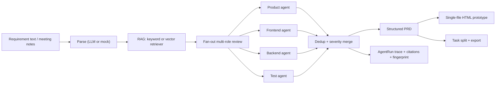

# ReqPilot

> A domain-aware requirements engineering agent: natural language in, structured
> PRD + multi-role review + interactive prototype + development tasks out.

ReqPilot turns meeting notes, chat records, and plain-language requirements into
a structured PRD, a quality-review report produced by product / frontend /
backend / test agents, a single-file HTML interactive prototype, and exportable
development tasks. It is built around four ideas:

1. **Structured outputs everywhere** — every LLM step returns schema-validated
   JSON (Pydantic), with one repair attempt and a deterministic safe fallback.
2. **Observable multi-agent workflow** — the pipeline is a LangGraph state
   machine with parallel per-role review, deduplication, severity grading, and
   citation-tracked evidence.
3. **Domain grounding via RAG** — a pluggable retriever injects domain terms and
   rules with source citations, reducing hallucinated review issues.
4. **Local-first, honest evaluation** — the whole pipeline runs without any API
   key using a rule-based mock provider; an optional OpenAI-compatible provider
   (DeepSeek etc.) is available, and `reqpilot eval` reports measured numbers.

## Architecture



## Quick start

Requirements: Python 3.11+ and [uv](https://docs.astral.sh/uv/).

```bash
git clone https://github.com/Sh1njuuovo/reqpilot.git
cd reqpilot
uv sync --extra dev
uv run reqpilot smoke
uv run pytest
```

`reqpilot smoke` runs the built-in sample requirement through the full pipeline
with the mock provider (no API key needed) and writes artifacts under
`reports/smoke/`.

### Optional real-LLM provider

```bash
export DEEPSEEK_API_KEY=sk-...
uv run reqpilot demo --provider llm
uv run reqpilot eval --provider llm
```

Any OpenAI-compatible endpoint works via `REQPILOT_LLM_BASE_URL`,
`REQPILOT_LLM_MODEL`, or `OPENAI_API_KEY`. Without a key, every step falls back
to the deterministic mock provider and records the fallback in the run trace.

### Optional vector retriever

```bash
uv sync --extra dev --extra vector
uv run reqpilot eval --retriever vector
```

The vector backend embeds the knowledge base with `all-MiniLM-L6-v2` and ranks
by cosine similarity. The retriever is pluggable: swap `keyword` for `vector` in
`smoke` / `demo` / `eval` / the API without touching the pipeline.

## CLI

| Command | What it does |
| --- | --- |
| `reqpilot smoke` | Run the sample requirement end-to-end (mock), assert success, write artifacts |
| `reqpilot demo` | Same pipeline, writes a demo bundle (`PRD.md`, `prototype.html`, `tasks.md`) |
| `reqpilot serve` | Start the FastAPI service (see API below) |
| `reqpilot eval` | Run the evaluation suite over `eval/cases/`, write measured metrics to `reports/eval/` |

`smoke` / `demo` / `eval` accept `--provider mock|llm` and `--retriever keyword|vector`.

## HTTP API

```bash
uv run reqpilot serve
```

- `POST /requirements` — body `{"text": "...", "domain": "generic", "provider": "mock"}`; runs the pipeline and returns the run summary.
- `GET /requirements/{run_id}` — run summary + traces.
- `GET /requirements/{run_id}/prd` — structured PRD (JSON).
- `GET /requirements/{run_id}/issues` — deduplicated review issues.
- `GET /requirements/{run_id}/tasks` — development tasks (JSON).
- `GET /requirements/{run_id}/prototype` — the single-file HTML prototype.

## Evaluation

`reqpilot eval` runs the pipeline over a curated 12-case set and measures schema
completeness, review-issue recall/precision, and dedup effectiveness. Golden
labels are written from a **human-reviewer perspective** (what a PM / frontend /
backend / QA would flag for that requirement), not derived from the mock rules,
so both providers are judged against the same external standard. Results are
written to `reports/eval/` as JSON + Markdown. Measured 2026-08-26:

| Metric | `mock` (rule baseline) | `llm` (DeepSeek-chat) |
| --- | ---: | ---: |
| Pipeline success rate | 100% (12/12) | 100% (12/12) |
| Field completeness | 86.1% | 100% |
| Issue recall | 38.1% | 79.6% |
| Issue precision | 91.7% | 17.9% |
| Dedup rate | 5.6% | 5.5% |
| Avg end-to-end latency | 5 ms/case (CPU) | 21.9 s/case (network) |

The contrast is the point: the LLM provider wins decisively on coverage
(completeness, recall) but over-flags (low precision); the deterministic mock
baseline is narrow but precise and instant. The product shape is "LLM for
breadth + deterministic/guardrail layers for precision", and this table is what
makes that tradeoff measurable instead of anecdotal. Example from `case-001`
(expense approval): `mock` returns 0 issues while `llm` flags 12 concrete ones
(e.g. 审批超时转人工机制未定义、金额精度与范围校验缺失、缺少发票附件字段).

Vector-retriever results match the keyword run on the same golden set
(`eval_mock_vector_latest.md`). Regenerate any report with
`uv run reqpilot eval` / `--provider llm` / `--retriever vector`.

## Project layout

```text
src/reqpilot/        core package (models, providers, pipeline, RAG, prototype, API, CLI)
eval/cases/          evaluation requirements + golden labels
eval/knowledge/      domain knowledge base used by the retriever
tests/               unit + integration tests
reports/             smoke, eval, and interview-pack artifacts
docs/design.md       design document
```

## License

MIT
