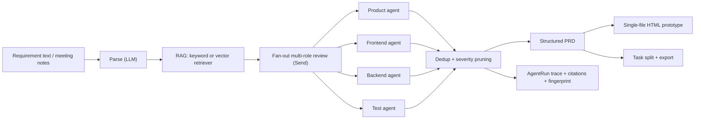

# ReqPilot

> An LLM-driven requirements engineering agent: natural language in, structured
> PRD + multi-role review + interactive prototype + development tasks out.

ReqPilot turns meeting notes, chat records, and plain-language requirements into
a structured PRD, a quality-review report produced by product / frontend /
backend / test agents, a single-file HTML interactive prototype, and exportable
development tasks. It is built around four ideas:

1. **LLM-native pipeline** — the whole chain (parse → review → PRD → tasks) runs
   on an OpenAI-compatible model, orchestrated as a LangGraph state machine.
2. **Structured outputs with guardrails** — every model call returns
   schema-validated JSON (Pydantic) with one repair attempt, transient retries,
   and typed error traces; issues are deduplicated and pruned to the top-N per
   role so the final list is human-reviewable.
3. **Domain grounding via RAG** — a pluggable retriever injects domain terms and
   rules with source citations, reducing hallucinated review findings.
4. **Evaluation against a human standard** — 12 curated cases with
   human-reviewer golden labels, measured end-to-end with a real LLM.

## Architecture



## Quick start

Requirements: Python 3.11+, [uv](https://docs.astral.sh/uv/), and a
DeepSeek / OpenAI-compatible API key.

```bash
git clone https://github.com/Sh1njuuovo/reqpilot.git
cd reqpilot
uv sync --extra dev
export DEEPSEEK_API_KEY=sk-...
uv run reqpilot smoke
uv run pytest
```

`reqpilot smoke` runs the built-in sample requirement through the full LLM
pipeline and writes artifacts under `reports/smoke/`. The provider is
OpenAI-compatible: set `REQPILOT_LLM_BASE_URL` / `REQPILOT_LLM_MODEL` /
`OPENAI_API_KEY` to switch endpoints.

## CLI

| Command | What it does |
| --- | --- |
| `reqpilot smoke` | Run the sample requirement end-to-end with the LLM, assert success, write artifacts |
| `reqpilot demo` | Same pipeline, writes a demo bundle (`PRD.md`, `prototype.html`, `tasks.md`) |
| `reqpilot serve` | Start the FastAPI service (see API below) |
| `reqpilot eval` | Run the evaluation suite over `eval/cases/`, write measured metrics to `reports/eval/` |

`smoke` / `demo` / `eval` accept `--retriever keyword|vector`. Without an API
key they exit with a clear error instead of producing fake output.

## HTTP API

```bash
uv run reqpilot serve
```

- `POST /requirements` — body `{"text": "...", "domain": "generic", "retriever_backend": "keyword"}`; runs the LLM pipeline and returns the run summary.
- `GET /requirements/{run_id}` — run summary + traces.
- `GET /requirements/{run_id}/prd` — structured PRD (JSON).
- `GET /requirements/{run_id}/issues` — deduplicated, pruned review issues.
- `GET /requirements/{run_id}/tasks` — development tasks (JSON).
- `GET /requirements/{run_id}/prototype` — the single-file HTML prototype.

## Reliability design

Every LLM step returns schema-validated JSON. On a validation failure the model
gets one repair attempt; on network / transient errors the call retries with
backoff (3 attempts); persistent failures are recorded as typed errors in the
`AgentRun` trace and the run is marked `failed` — the pipeline never silently
substitutes fake content. Issue lists go through dedup (cross-role merge) and
per-role severity pruning (`REQPILOT_MAX_ISSUES_PER_ROLE`, default 5), so a
verbose model stays reviewable.

## Evaluation

`reqpilot eval` runs the pipeline over a curated 12-case set and measures schema
completeness, review-issue recall, and dedup effectiveness. Golden labels are
written from a **human-reviewer perspective** (what a PM / frontend / backend /
QA would flag for that requirement). Measured 2026-08-26 with DeepSeek-chat:

- Pipeline success rate: 100% (12/12)
- Field completeness: 100%
- Issue recall (vs human golden): 86.5%
- Dedup + prune reduction: 1.3%
- Average end-to-end latency: 18.9 s/case (network-bound)

Issue precision on the coarse (role, category) label grid is conservative
(~19%) because the model over-flags; that is exactly why the dedup + per-role
pruning guardrail exists — it caps the final list at the most severe issues per
role so a human can review it. Concrete example from `case-001` (expense
approval): the model flags 审批超时转人工机制未定义、金额精度与范围校验缺失、
缺少发票附件字段, which are precisely the points a human reviewer would raise.

Regenerate the report any time with `uv run reqpilot eval`; use
`--retriever vector` to evaluate with the optional embedding retriever.

## Project layout

```text
src/reqpilot/        core package (models, providers, pipeline, RAG, prototype, API, CLI)
eval/cases/          evaluation requirements + human-reviewer golden labels
eval/knowledge/      domain knowledge base used by the retriever
tests/               unit + integration tests (deterministic provider double)
reports/             smoke, eval, and interview-pack artifacts
docs/design.md       design document
```

## License

MIT
